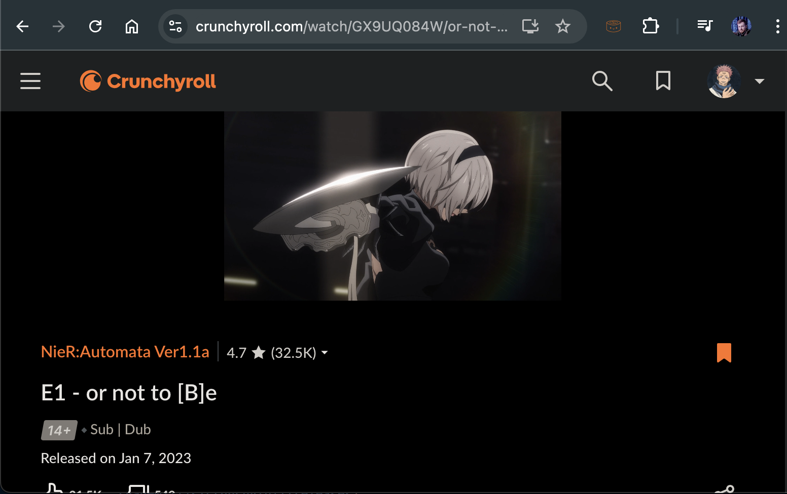
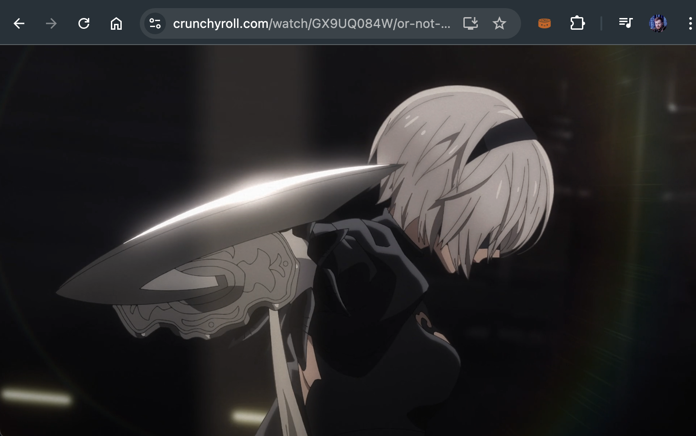

  
  <h1> crunchyfull </h1>

A Chrome extension to make the Crunchyroll web video player take up the whole window.

Before:

After:

## Installation

1. Download the [latest `Source code (zip)` archive](https://github.com/ryan-willis/crunchyfull/releases).

2. Extract the `.zip` archive.

3. Open Chrome and navigate to `chrome://extensions`.

4. Enable Developer Mode by clicking the toggle switch in the top right corner.

5. Click the "Load unpacked" button and select the extracted folder (the one with `manifest.json` in it).
